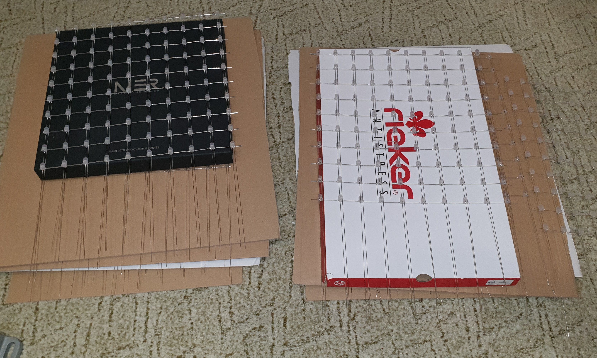
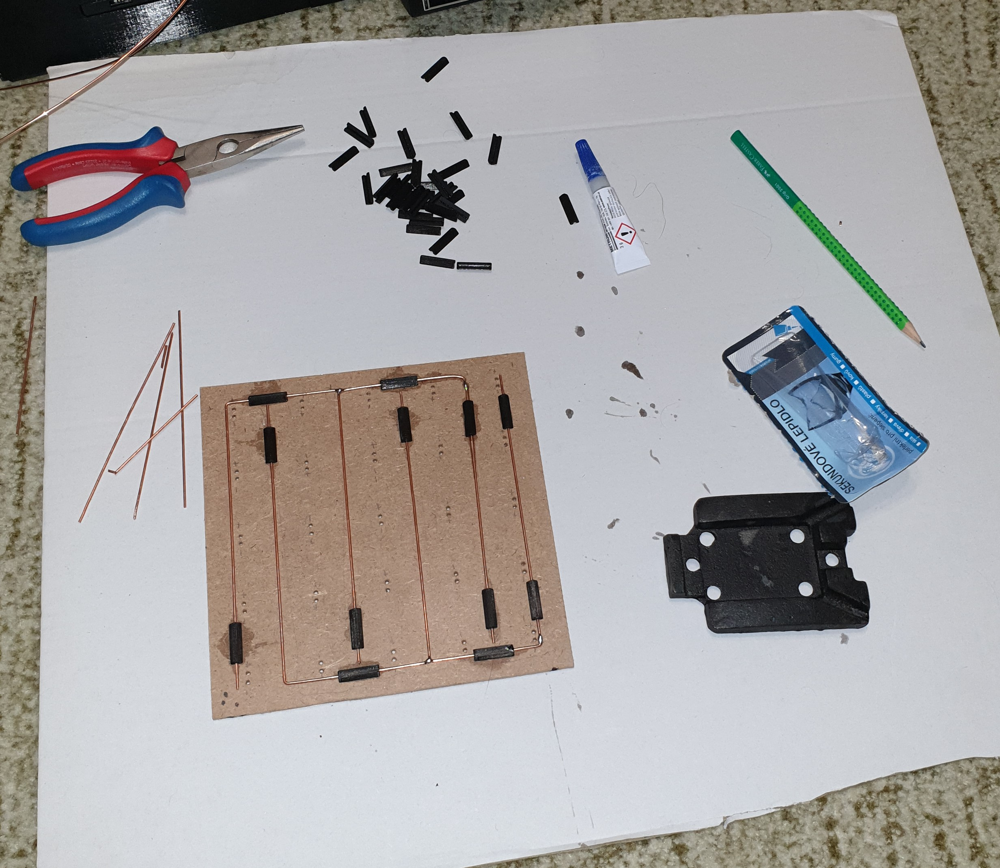
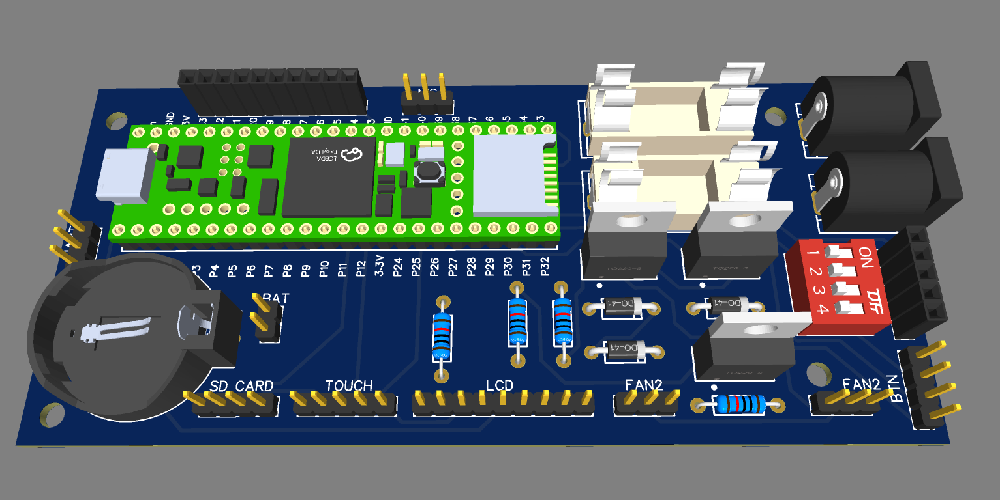
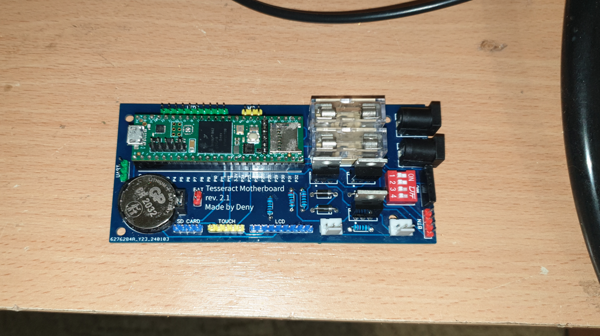

# The Tesseract

## Introduction
This project is my DIY take on the popular RGB LED cube. I have always been fascinated by the mesmerizing patterns and animations that can be created with these cubes, so I used my school seminary work as an oporunity to build one myself and decided to turn in into a fully open-source project and guide for anyone who wants to build their own.

## My Design
I decided to build a 10^3 cube, which means it has 1000 LEDs. I was thinking about making it bigger (12^3), but I wanted to keep the cost reasonable. In hindsight, if I had known how much time and effort it would take to build this cube, I would have gone for a much smaller one. But I am happy with the result, and I learned a lot in the process. 
I wanted the cube to be RGB and keep the electronics as simple as possible, so I used 8mm WS2812 LEDs, which are individually addressable and only need one data connection per LED stream. 
Most of the frame is make of custom PETG 3D printed parts, with some aluminum profiles and HDF board for structural support. 
For the brains of the cube, I used a teensy 4.1 microcontroller, which is a very powerful board that can handle the all of the LEDs and peripherals with ease. 
The user interface consists of a 4" TFT touch screen and a reset button (just in case). 
In the end the total cost was around 750 USD (720€), which is a lot, but I spent a lot of money on prototypes that ended up in the garbage, so I think it could be done for around 450 USD (430€) if you know what you are doing beforehand.

## Features
- 10 animations
- VU meter (audio reactive effect)
- TETRIS game via SNES controller
- Text rendering
- aprox. 300fps (effect dependent)

## How to build it

> [!TIP]
> - Refer to the CAD files and schematics, I tried to make them as detailed as possible.
> - Test the LEDs before soldering them, I know it is a pain (it took me 7 hours), but it is worth it.
> - Use the printed jigs (more on that later) to make the assembly easier.
> - **Turn off the power supply when working on the cube**, I know it is obvious, but I fried more than 30 LEDs after the cube was put together and resoldering them was a nightmare.
> - A good soldering iron helps a lot.

### Step 1: The LED structure :bulb:
The cube is split into walls and layers. Each wall has 100 LEDs, in 10 columns with alternating directions. Every wall is flipped 180º from the previous one. This results in a zig-zag pattern when viewed from the top. Every layer has its own data connection, to the MCU (more on that later). The walls are inserted into base plates and soldered together.

*Photo from the top here*
*Photo from the side here*

### Step 2: Preparing the wire
The LED connections are made with 0.8mm diameter silver copper wire. I got mine in 13m spools, and I ended up using 9 of them. The wire needs to be straightened and cut. 
Use a drill and a wise (or better a helper and pliers) to hold, pull and twist the wire (changing the direction every 8sec) until it is straight. Then use the cutting jig to cut the wire into 21mm pieces with wire cutters. For the collum power wires, cut 100 pieces of around 450mm (I used 500mm and it was too much, but I wanted to be safe). 

### Step 3: Soldering the LEDs
**Print the jigs**, soldering is practically impossible without them. 
There are 2 jigs (for the odd and even walls), each consisting of 4 parts that interlock like jig-saw puzzle. The 3d prints are not very heat resistant so I ended up melting them after 2-3 layers so I reprinted all of them 3 times to make the assembly easier.

Insert the LEDs into the jig in the right orientation, bend the outer legs to their respective sides and the inner two legs up. 
Cut the legs 2mm from the LED body and solder a connection wire to the outer legs between all of the LEDs. You should end up with 90 connections in total. 
Then solder the longer power wire to the inner legs, connecting all of the LEDs in the column. You should end up with 10 connections in total. 

Repeat this process 5 times for each jig, to end up with 10 walls. 

*This looks quick and easy, but it took me around 3 months (working after school and on weekends) to finish all of the walls.*

### Step 4: Making the base plates
The base plates are made of two layers: a 3mm HDF board and a 3D printed grid. And they are split into 4 parts to make the manufacturing easier.

Cut 4 HDF boards to 175x175mm *drill holes for the LEDs*. The 4 plates are identical, but each is mirrored to the other.  
The drilling has to be precise, so I used a cheap 3018 CNC with a 1mm drill to make the HDF boards. You can find the excelon files in the CAD folder. 

The 3D printed boards are just for looks and you can pain the HDF boards instead, but I think the 3D printed boards make the cube look more professional. I wasnt sure about the accuracy of the 3D printer for such small holes, so I made the holes Only on the bottom really small and drilled them on a drill press to the right size (0.8mm). 
I also picked a nice looking top infill pattern in the slicer to make the cube look better.

The front left plates need 10 holes in the front left corner for the data connections, I decided to make those by hand with a drill press, but you can also use the CNC for that. 

### Step 5: Connecting the walls to the base plates

This is definitely the most finicky part of the build. The walls have to be inserted into the base plates and soldered together. I used a very unstable rig to lower the walls into the base plates one by one (it ended ub collapsing and breaking a lot of solder joints, so I would recommend using something else). 

Insert the walls in an alternating pattern, checking the data flow. Start at the back with a wall that has the data connection going to the left, then insert a wall with the data connection going to the right, and so on. You should end up with a zig-zag pattern. Starting in the front left corner where the data input holes are. 
After the walls are inserted, the connections have to be soldered. Cut some more silver copper wire and solder the data connections to end of the walls. 

> [!TIP]
> - Print the brackets to hold the walls in place while soldering, it makes the process a lot easier. And reduces the risk of breaking the walls.

### Step 6: Wiring the base plates

You might have noticed that the polarity of the columns is a mess. This is to make the data connections easier and allow for more even current distribution.

I used 1.5mm2 wire and a lot of solder to make what I call the power planes. Each corner consists of two "power forks", one for +5V and one for GND. The silvered copper wire of each collum is directly soldered to the power planes. 

The thick wire is secured to the HDF with printed clamps and superglue (I would recommend using hotglue, because the superglue was very messy). 

> [!CAUTION]
> Pay attention to the polarity of the LEDs, flipping the power wires will burn the LEDs.

To connect the base plates to the PSUs, I used flexible 1.5mm2 wire and XT60 connectors soldered to the power planes. The other side of the XT60 connectors is soldered to the PSU wires. 
The data connections are made with thin ribbon cable, which is soldered to the 10 data connections on the front left corner of the base plates. The other side of the ribbon cable is connected to the motherboard with dupont connectors. 

### Step 7: Making the base frame

The frame is composed of 4 printed corners joined by 4 butterfly clips, 2 T aluminum profiles that hold the LED base plates and 5mm 350x350mm HDF board that everything is mounted on.
 

Each corner has features and holes to mount specific peripherals (ex. the touch screen, the power inlet etc.). 
The remaining stuff is mounted on the HDF board with small wood screws - refer to the CAD files for the exact positions. 

### Step 8: The motherboard

The motherboard is a custom PCB that holds the Teensy 4.1, fusees, power distribution, battery clip, and all connectors for the peripherals.
I started by making a prototype on a breadboard and milling the next one on my CNC. The final version was made by JLCPCB, because it was too complex for me to make at home.

  

  

The board has DC jacks and fuses for 5V and 12V input (both required), a battery clip for the RTC, a port with DIP switches for a MAX9814 microphone breakout board, two MOSFET driven fan ports, breakout pins for the SPI touch screen with integrated SD card reader, and breakout pins for a reset button mounted in the front. There are also UART pins and analog MIC inputs, but I didn't use them in the final version. 
There are also dupont pins for the data connections to each layer of the cube. 
The most important part is the Teensy 4.1, which is the brains of the cube. It runs at 600MHz and has support for DMA which allows the cube to get up to 300fps in some animations. 

### Step 9: Putting it all together :star:

If you have made it this far, congratulations:star2:! You are almost done. Now you just have to put everything together without breaking anything. 

Start by mounting all of the peripherals to the base frame.
- 2x 5V 40A PSU
- 12V 2A PSU
- The touch screen
- The reset button
- The USB hub
- 2x 12V fan
- C13 power inlet
- Back went cover
- Back IO (optional and not recommended)

    

