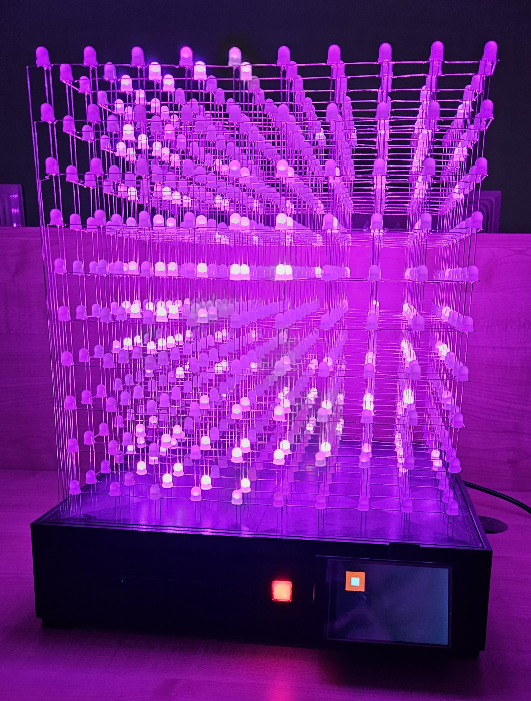

# The Tesseract

## Introduction
This project is my DIY take on the popular LED cube. I have always been fascinated by the mesmerizing patterns and animations that can be created with these cubes, so I used my school seminary work as an oporunity to build one myself and decided to turn in into a fully open-source project and guide for anyone who wants to build their own.

## My Design
I decided to build a 10^3 cube, which means it has 1000 8mm WS2812 LEDs. I was thinking about making it bigger (12^3), but I wanted to keep the cost reasonable. In hindsight, if I had known how much time and effort it would take to build this cube, I would have gone for a much smaller one. But I am happy with the result, and I learned a lot in the process. 
Most of the frame is make of custom PETG 3D printed parts, with some aluminum profiles and HDF board for structural support. 
For the brains of the cube, I used a teensy 4.1 microcontroller, which is a very powerful board that can handle the all of the LEDs and peripherals with ease. 
The user interface consists of a 4" TFT touch screen and a reset button (just in case). 
In the end the total cost was around 750 USD (720€), which is a lot, but I spent a lot of money on prototypes that ended up in the garbage, so I think it could be done for around 450 USD (430€) if you know what you are doing beforehand.

## Features
- 10 animations
- VU meter (audio reactive effect)
- TETRIS game via SNES controller
- Text rendering
- aprox. 300fps (effect dependent)

## How to build it
### Tips along the way
- Refer to the CAD files and schematics, I tried to make them as detailed as possible.
- Test the LEDs before soldering them, I know it is a pain (it took me 7 hours), but it is worth it.
- Use the printed jigs (more on that later) to make the assembly easier.
- **Turn off the power supply when working on the cube**, I know it is obvious, but I fried more than 30 LEDs after the cube was put together and resoldering them was a nightmare.
- A good soldering iron helps a lot.

### Step 1: The LED structure
The cube is split into walls and layers. Each wall has 100 LEDs, in 10 columns with alternating directions. Every wall is flipped 180º from the previous one. This results in a zig-zag pattern when viewed from the top. Every layer has its own data connection, to the MCU (more on that later). The walls are inserted into base plates and soldered together.

*Photo from the top here*
*Photo from the side here*

### Step 2: Soldering the LEDs
**Print the jigs**, soldering is practically impossible without them. 
There are 2 jigs (for the odd and even walls), each consisting of 4 parts that interlock like jig-saw puzzle. The 3d prints are not very heat resistant so I ended up melting them after 2-3 layers so I reprinted all of them 3 times to make the assembly easier.

